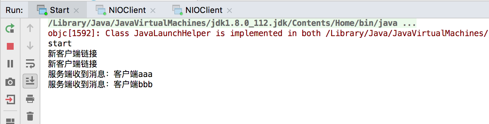

# topic1NIO
1. 基于 NIO 实现多人聊天室功能 - 服务端只有 1 个selector
2. 如何启动
    - 启动 NIOServer
    - 启动 多个 NIOClient 连接到服务端
    - 在 NIOClient 命令行下发送信息，可以发现服务端和其他客户端均收到消息

# topic4NIONetty
1. 基于多线程 NIO 实现多人聊天室功能(参照Netty3 线程模型) - 服务端有 多 个selector
2. 如何启动
    - 启动 Start
    - 启动 topic1NIO 路径下的多个 NIOClient 连接到服务端
    - 在 NIOClient 命令行下发送信息，可以发现服务端和其他客户端均收到消息

